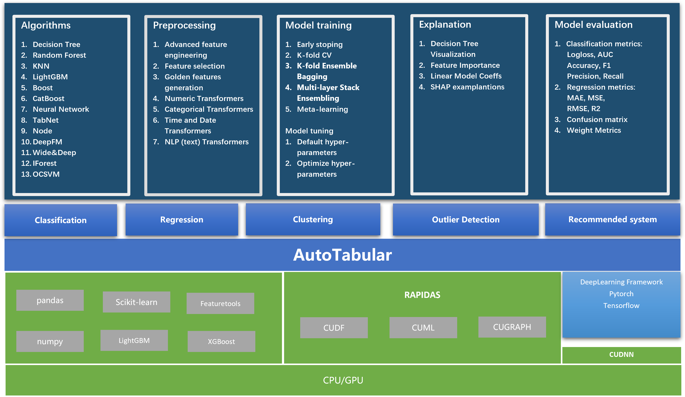

# AutoTabular

[](https://www.nature.com/articles/nature14539)
[](https://papers.nips.cc/book/advances-in-neural-information-processing-systems-31-2018)
[](https://papers.nips.cc/book/advances-in-neural-information-processing-systems-31-2018)
[](https://papers.nips.cc/book/advances-in-neural-information-processing-systems-31-2018)


AutoTabular automates machine learning tasks enabling you to easily achieve strong predictive performance in your applications.  With just a few lines of code, you can train and deploy high-accuracy machine learning and deep learning models tabular data.




## What's good in it?

- It is using the RAPIDS as back-end support, gives you the ability to execute end-to-end data science and analytics pipelines entirely on GPUs.
- It Supports many anomaly detection models: ,
- It using meta learning to accelerate  model selection and parameter tuning.
- It is using many Deep Learning models for tabular data: `Wide&Deep`,  `DCN(Deep & Cross Network)`, `FM`, `DeepFM`, `PNN` ...
- It is using many machine learning algorithms: `Baseline`, `Linear`, `Random Forest`, `Extra Trees`, `LightGBM`, `Xgboost`, `CatBoost`, and `Nearest Neighbors`.
- It can compute Ensemble based on greedy algorithm from [Caruana paper](http://www.cs.cornell.edu/~alexn/papers/shotgun.icml04.revised.rev2.pdf).
- It can stack models to build level 2 ensemble (available in `Compete` mode or after setting `stack_models` parameter).
- It can do features preprocessing, like: missing values imputation and converting categoricals. What is more, it can also handle target values preprocessing.
- It can do advanced features engineering, like: [Golden Features](https://supervised.mljar.com/features/golden_features/), [Features Selection](https://supervised.mljar.com/features/features_selection/), Text and Time Transformations.
- It can tune hyper-parameters with `not-so-random-search` algorithm (random-search over defined set of values) and hill climbing to fine-tune final models.

##  Installation

The sources for AutoTabular can be downloaded from the `Github repo`.

You can either clone the public repository:

```bash
# clone project
git clone https://apulis-gitlab.apulis.cn/apulis/AutoTabular/autotabular.git
# First, install dependencies
pip install -r requirements.txt
```

Once you have a copy of the source, you can install it with:

```bash
python setup.py install
```
## Example
Next, navigate to any file and run it.
```bash
# module folder
cd example

# run module (example: mnist as your main contribution)
python binary_classifier_Titanic.py
```

### Auto Feature generate & Selection
```python
TODO
```
### Deep Feature Synthesis
```python
import featuretools as ft
import pandas as pd
from sklearn.datasets import load_iris

# Load data and put into dataframe
iris = load_iris()
df = pd.DataFrame(iris.data, columns=iris.feature_names)
df['species'] = iris.target
df['species'] = df['species'].map({
    0: 'setosa',
    1: 'versicolor',
    2: 'virginica'
})
# Make an entityset and add the entity
es = ft.EntitySet()
es.add_dataframe(
    dataframe_name='data', dataframe=df, make_index=True, index='index')
# Run deep feature synthesis with transformation primitives
feature_matrix, feature_defs = ft.dfs(
    entityset=es,
    max_depth=3,
    target_dataframe_name='data',
    agg_primitives=['mode', 'mean', 'max', 'count'],
    trans_primitives=[
        'add_numeric', 'multiply_numeric', 'cum_min', 'cum_mean', 'cum_max'
    ],
    groupby_trans_primitives=['cum_sum'])

print(feature_defs)
print(feature_matrix.head())
print(feature_matrix.ww)
```
### GBDT Feature Generate
```python
titanic = pd.read_csv('autotabular/datasets/data/Titanic.csv')
# 'Embarked' is stored as letters, so fit a label encoder to the train set to use in the loop
embarked_encoder = LabelEncoder()
embarked_encoder.fit(titanic['Embarked'].fillna('Null'))
# Record anyone travelling alone
titanic['Alone'] = (titanic['SibSp'] == 0) & (titanic['Parch'] == 0)
# Transform 'Embarked'
titanic['Embarked'].fillna('Null', inplace=True)
titanic['Embarked'] = embarked_encoder.transform(titanic['Embarked'])
# Transform 'Sex'
titanic.loc[titanic['Sex'] == 'female', 'Sex'] = 0
titanic.loc[titanic['Sex'] == 'male', 'Sex'] = 1
titanic['Sex'] = titanic['Sex'].astype('int8')
# Drop features that seem unusable. Save passenger ids if test
titanic.drop(['Name', 'Ticket', 'Cabin'], axis=1, inplace=True)

trainMeans = titanic.groupby(['Pclass', 'Sex'])['Age'].mean()

def f(x):
    if not np.isnan(x['Age']):  # not NaN
        return x['Age']
    return trainMeans[x['Pclass'], x['Sex']]

titanic['Age'] = titanic.apply(f, axis=1)
rows = titanic.shape[0]
n_train = int(rows * 0.77)
train_data = titanic[:n_train, :]
test_data = titanic[n_train:, :]

X_train = titanic.drop(['Survived'], axis=1)
y_train = titanic['Survived']

clf = XGBoostFeatureTransformer(task='classification')
clf.fit(X_train, y_train)
result = clf.concate_transform(X_train)
print(result)

clf = LightGBMFeatureTransformer(task='classification')
clf.fit(X_train, y_train)
result = clf.concate_transform(X_train)
print(result)

clf = GBDTFeatureTransformer(task='classification')
clf.fit(X_train, y_train)
result = clf.concate_transform(X_train)
print(result)

clf = CatboostFeatureTransformer(task='classification')
clf.fit(X_train, y_train)
result = clf.concate_transform(X_train)
print(result)

from sklearn.linear_model import LogisticRegression
from sklearn.model_selection import train_test_split
from sklearn.metrics import roc_auc_score

lr = LogisticRegression()
x_train_gb, x_test_gb, y_train_gb, y_test_gb = train_test_split(
    result, y_train)
x_train, x_test, y_train, y_test = train_test_split(X_train, y_train)

lr.fit(x_train, y_train)
score = roc_auc_score(y_test, lr.predict(x_test))
print('LR with GBDT apply data, train data shape : {0}  auc: {1}'.format(
    x_train.shape, score))

lr = LogisticRegression()
lr.fit(x_train_gb, y_train_gb)
score = roc_auc_score(y_test_gb, lr.predict(x_test_gb))
print('LR with GBDT apply data, train data shape : {0}  auc: {1}'.format(
    x_train_gb.shape, score))
```
### Golden Feature Generate
```python
from autofe import GoldenFeatureTransform

titanic = pd.read_csv('autotabular/datasets/data/Titanic.csv')
embarked_encoder = LabelEncoder()
embarked_encoder.fit(titanic['Embarked'].fillna('Null'))
# Record anyone travelling alone
titanic['Alone'] = (titanic['SibSp'] == 0) & (titanic['Parch'] == 0)
# Transform 'Embarked'
titanic['Embarked'].fillna('Null', inplace=True)
titanic['Embarked'] = embarked_encoder.transform(titanic['Embarked'])
# Transform 'Sex'
titanic.loc[titanic['Sex'] == 'female', 'Sex'] = 0
titanic.loc[titanic['Sex'] == 'male', 'Sex'] = 1
titanic['Sex'] = titanic['Sex'].astype('int8')
# Drop features that seem unusable. Save passenger ids if test
titanic.drop(['Name', 'Ticket', 'Cabin'], axis=1, inplace=True)

trainMeans = titanic.groupby(['Pclass', 'Sex'])['Age'].mean()

def f(x):
    if not np.isnan(x['Age']):  # not NaN
        return x['Age']
    return trainMeans[x['Pclass'], x['Sex']]

titanic['Age'] = titanic.apply(f, axis=1)

X_train = titanic.drop(['Survived'], axis=1)
y_train = titanic['Survived']
print(X_train)
gbdt_model = GoldenFeatureTransform(
    results_path='./', ml_task='BINARY_CLASSIFICATION')
gbdt_model.fit(X_train, y_train)
results = gbdt_model.transform(X_train)
print(results)
```
### Neural Network Embeddings
```python
# data url
"""https://www.kaggle.com/c/house-prices-advanced-regression-techniques."""
data_dir = '/media/robin/DATA/datatsets/structure_data/house_price/train.csv'
data = pd.read_csv(
    data_dir,
    usecols=[
        'SalePrice', 'MSSubClass', 'MSZoning', 'LotFrontage', 'LotArea',
        'Street', 'YearBuilt', 'LotShape', '1stFlrSF', '2ndFlrSF'
    ]).dropna()

categorical_features = [
    'MSSubClass', 'MSZoning', 'Street', 'LotShape', 'YearBuilt'
]
output_feature = 'SalePrice'
label_encoders = {}
for cat_col in categorical_features:
    label_encoders[cat_col] = LabelEncoder()
    data[cat_col] = label_encoders[cat_col].fit_transform(data[cat_col])

dataset = TabularDataset(
    data=data, cat_cols=categorical_features, output_col=output_feature)

batchsize = 64
dataloader = DataLoader(dataset, batchsize, shuffle=True, num_workers=1)

cat_dims = [int(data[col].nunique()) for col in categorical_features]
emb_dims = [(x, min(50, (x + 1) // 2)) for x in cat_dims]
device = torch.device('cuda' if torch.cuda.is_available() else 'cpu')
model = FeedForwardNN(
    emb_dims,
    no_of_cont=4,
    lin_layer_sizes=[50, 100],
    output_size=1,
    emb_dropout=0.04,
    lin_layer_dropouts=[0.001, 0.01]).to(device)
print(model)
num_epochs = 100
criterion = nn.MSELoss()
optimizer = torch.optim.Adam(model.parameters(), lr=0.1)
for epoch in range(num_epochs):
    for y, cont_x, cat_x in dataloader:
        cat_x = cat_x.to(device)
        cont_x = cont_x.to(device)
        y = y.to(device)
        # Forward Pass
        preds = model(cont_x, cat_x)
        loss = criterion(preds, y)
        # Backward Pass and Optimization
        optimizer.zero_grad()
        loss.backward()
        optimizer.step()
    print('loss:', loss)
```

### Citation
If you use AutoTabular in a scientific publication, please cite the following paper:

Robin, et al. ["AutoTabular: Robust and Accurate AutoML for Structured Data."](https://arxiv.org/abs/2003.06505) arXiv preprint arXiv:2003.06505 (2021).

BibTeX entry:

```bibtex
@article{agtabular,
  title={AutoTabular: Robust and Accurate AutoML for Structured Data},
  author={JianZheng, WenQi},
  journal={arXiv preprint arXiv:2003.06505},
  year={2021}
}
```

## License

This library is licensed under the Apache 2.0 License.

## Contributing to AutoTabular

We are actively accepting code contributions to the AutoTabular project. If you are interested in contributing to AutoTabular, please contact me.
